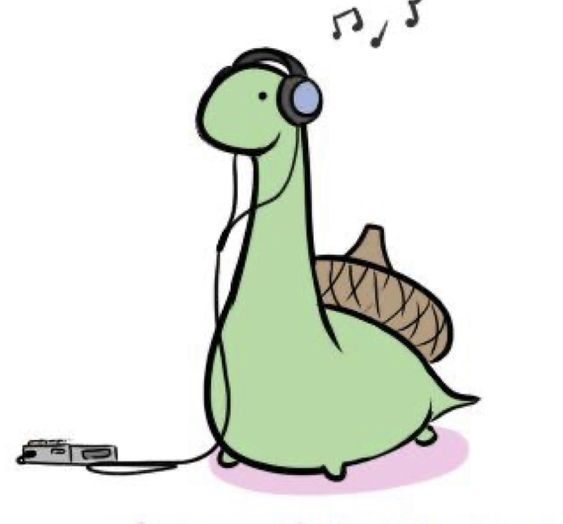

## **Hi there** :sauropod:

### **co nieco o mnie:**

***

- :mortar_board: studiuję informatykę i systemy inteligentne na AGHu
- :snake: w wolnych chwilach staram się rozwijać moje umiejętności programowania 
- :notes: jestem muzykiem, a moją pierwszą miłością na zawsze pozostanie moja najstarsza gitara
- :art: czasem coś narysuję, wyszydełkuję lub sprawdzę się jako wizażystka 
- :two_hearts: zawsze chętnie służe pomocą, radą i zrozumieniem

### **link do mojej strony ->** [maadzia.github.io](https://maadzia.github.io/)

***

***

A tutaj podrzucam jeszcze linki do [repozytorium](https://github.com/maadZia/code_contests) oraz bardzo ciekawego [artykułu](https://arxiv.org/pdf/2212.01020v1.pdf) dotyczącego przełomu w programowaniu z wykorzystaniem sztucznej inteligencji, znalezionego na stronie [Papers with Code](https://paperswithcode.com/paper/programming-is-hard-or-at-least-it-used-to-be)
